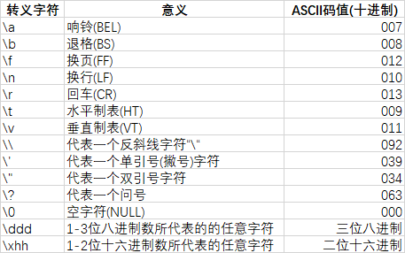

# 符号的技巧    

## 1、注释符号    
- 编译器会在编译过程中删除注释，但不是简单的删除而是用空格代替；
- 编译器认为双引号括起来的内容都是字符串，双斜杠也不例外；
- “`/*... ...*/`”型注释不能被嵌套。
- 编译器将“`/*`”作为一般注释的开始，把“`/*`”后的内容都当成注释开始，知道“`*/`”出现位置。    

## 2、注释写作原则：    
- 注释应该准确易懂，防止二义性，错误的注释有害而无利；    
- 注释是对代码的提示，避免臃肿和喧宾夺主；    
- 一目了然的代码避免加注释；    
- 不要用缩写来注释代码，这样可能会产生误解；    
- 注释用于阐述原因而不是用于用于描述程序的运行过程。    

## 3、接续符和转义符    
- C语言中的接续符(`"\"`)是指示编译器行为的利器   
- C语言中的转义符(`"\"`)主要用于表示无回显字符，也可以用于表示常规字符：   
    
- **接续符的使用**：    
  - 编译器会将反斜杠剔除，跟在反斜杠后面的字符自动接到前一行；    
  - 在接续单词时，反斜杠之后不能有空格，反斜杠的下一行之前也不能有空格；    
  - 接续符适合在定义宏代码块时使用。    

- **宏代码块的定义**    
C语言中`#define`定义的宏必须在一行内之内完成。    
```c
#define SWAP(a,b) \
{                 \
    int temp = a; \
    a = b;        \
    b = temp;     \
} 
```    
 
- **转义符小结**   
  - C语言中的反斜杠(\)同时具有接续符和转义符的作用；   
  - 当反斜杠作为接续符使用时刻直接出现在程序中；   
  - 当反斜杠作为转义符使用时需出现在字符或字符串中。    

## 4、单引号和双引号   
  - C语言中的**单引号**用来表示**字符常量**；
  - C语言中的**双引号**用来表示**字符串常量**。   
```c
'a'表示字符常量，在内存中占1个字节，'a'+1表示'a'的ASCII码加1，结果为'b';
"a"表示字符串常量，在内存中占2个字节(a和结束符'\0')，"a"+1表示指针运算，结果指向"a"结束符'\0'。   
```
**错误示例：**   
```c
#include <stdio.h>
int main()
{
    char c = " ";   //这里错误，应该为' '，因为指针占4个字节，而char占一个字节，所以c只保存了" "字符串低8位地址。
    while( c=="\t" || c==" " || c=="\n" )  // 这里也应该将双引号改为单引号
    {
        scanf("%c", &c);
    }
    return 0;
}
```

- **单引号和双引号小结:**    
  - **本质上单引号括起来的一个字符代表整数**；   
  - **双引号括起来的字符代表一个指针**；   
  - C编译器接受字符和字符串的比较，可意义是错误的；
  - C编译器允许字符串对字符变量赋值，其意义是可笑的。   

## 5、逻辑运算符使用分析   
**程序中的短路：**      
- || 从左向右开始计算，当遇到为真的条件时停止计算，整个表达式为真；所有条件为假时表达式才为假；
- && 从左向右开始计算，当遇到为假的条件时停止计算，整个表达式为假；所有条件为真时表达式才为真。
- C语言中的逻辑符"!"只认得0，只知道见了0就返回1。因此当其作用的值不是0时，其结果为0。
- 三目运算符(a?b:c)可以作为逻辑运算符的载体，当a的值为真时，返回b的值，否则返回c的值。
```c
int a = 1;
int b = 2;
int c = 0;

c = a < b ? a  : b;
*(a < b ? &a : &b) = 3;
```